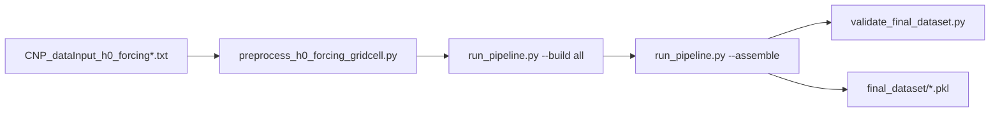

# h0 Forcing Assembly Fix — Workflow Report

**Date:** 2026-06-19  
**Repo:** [LandSim_dataGEN](https://github.com/daliwang/LandSim_dataGEN)  
**Branch:** `h0-forcing-vectorized`  
**Worktree:** `LandSim_dataGEN_h0_vectorized`  
**Dataset:** `output_h0_forcing_0001_0020` (0.25° E3SMV3, years 0001–0020)

---

## 1. Summary

Validation of the assembled `final_dataset` revealed that all six forcing columns (FLDS, PSRF, FSDS, QBOT, PRECTmms, TBOT) contained **NaN for 232 of 240 monthly values** per gridcell. The forcing **module artifacts were correct** (240/240 finite values). The bug was in **assembly**: `calculate_monthly_avg()` mis-handled already-monthly h0 forcing when `TIME_SERIES_LENGTH` equals the monthly length (`YEARS_IN_DATA × 12 = 240`).

A one-line logic fix in `scripts/run_pipeline.py` was applied. Re-assembly was submitted to SLURM (job **17713**) with post-assembly validation enabled.

---

## 2. Repository and Branch Strategy

| Item | Value |
|------|-------|
| Remote | `git@github.com:daliwang/LandSim_dataGEN.git` |
| Active branch | `h0-forcing-vectorized` |
| Base branch | `main` (stable DATM/legacy pipeline) |
| Prior remote branch | `origin/vectorization-025deg` (0.25° vectorization work) |

**Decision (2026-06-18):** Push `h0-forcing-vectorized` as a long-lived feature branch; **do not merge to `main` yet** until end-to-end build validates and conflicts with `main`'s script-based h0 path are resolved.

**Commits on this branch (chronological):**

1. `c2309fc` — 0.25° vectorization optimizations  
2. `8d6e044` — 0.25° dataset generation guide  
3. `9695c35` — Integrated h0-derived forcing pipeline (configs, preprocess, SLURM build scripts)  
4. *(this commit)* — Assembly fix + assembly-only SLURM workflow + this report  

---

## 3. Validation Workflow (How the Bug Was Found)

### 3.1 Command

```bash
cd LandSim_dataGEN_h0_vectorized

python3 scripts/validate_final_dataset.py \
  --config-input config/CNP_dataInput_h0_forcing_gridcell.txt \
  --final-dir output_h0_forcing_0001_0020/final_dataset
```

Use `--config-input` (not only `LANDSIM_CONFIG_FILE`) so `BASE_OUTPUT_ROOT` and artifact paths resolve correctly.

### 3.2 Initial result: **FAILED**

- **396/396** batch pickle files present  
- Row counts matched `A_index_core` per batch  
- **All sampled forcing rows failed:** non-finite values in FLDS, PSRF, FSDS, QBOT, PRECTmms, TBOT  

Example pattern (batch 01, every row):

| Metric | Value |
|--------|-------|
| Series length | 240 (expected: 20 years × 12 months) |
| Finite values | **8** |
| NaN values | **232** |

Spot-check across batches 01, 50, 100, 150, 200, 300, 396 showed the same 8/240 pattern.

### 3.3 Artifacts vs final dataset

| Source | FLDS row 0 finite count |
|--------|-------------------------|
| `A_forcing_ds4_flds/batch_01.pkl` | **240/240** |
| `final_dataset/training_data_batch_01.pkl` | **8/240** |

Forcing modules were built correctly; corruption occurred during **assembly merge + monthly conversion**.

---

## 4. Root Cause

### 4.1 Config interaction

`config/CNP_dataInput_h0_forcing_gridcell.txt` sets:

```
TIME_SERIES_LENGTH: 240
YEARS_IN_DATA: 20
STEPS_PER_DAY: 1
```

Forcing NetCDF and preprocessed gridcell files store **monthly** data: 20 × 12 = **240** timesteps.

### 4.2 Faulty logic (before fix)

In `assemble_final_dataset()`, each forcing column passes through `calculate_monthly_avg()`. The “already monthly” guard was:

```python
if len(time_series) % 12 == 0 and len(time_series) != config.TIME_SERIES_LENGTH:
    return ...  # keep as-is
```

When `len == TIME_SERIES_LENGTH == 240`, the guard **did not fire**. The function then treated 240 monthly values as **daily** sub-daily data and re-aggregated using `DAYS_PER_MONTH` (365-day calendar):

- ~8 valid monthly means computed from the first ~365 “days”  
- Remaining slots filled with **NaN** (empty slices → `mean` of empty → NaN)

Reproducing on artifact data confirmed `calculate_monthly_avg(artifact_FLDS)` matched the broken `final_dataset` values exactly.

### 4.3 Why `main` configs did not hit this

Default `CNP_dataInput.txt` uses `TIME_SERIES_LENGTH: 179580` (daily). Monthly preprocessed forcing (len=240) correctly satisfied `len != TIME_SERIES_LENGTH`. The bug only appears when **`TIME_SERIES_LENGTH` is set to the monthly length** for h0 configs.

---

## 5. Fix Applied

**File:** `scripts/run_pipeline.py` — `calculate_monthly_avg()`

```python
expected_monthly_len = int(config.YEARS_IN_DATA) * 12
# Already monthly (h0 forcing, DATM preprocessed, etc.): keep as-is.
if len(time_series) % 12 == 0 and (
    len(time_series) == expected_monthly_len
    or len(time_series) != config.TIME_SERIES_LENGTH
):
    return [float(x) for x in np.asarray(time_series, dtype=float).reshape(-1).tolist()]
```

**Verification (post-fix, before full re-assembly):**

```bash
python3 -c "
# load config, artifact batch_01 FLDS, run calculate_monthly_avg
# → 240 finite values
"
# batch 50 final_dataset after partial re-assembly: FLDS finite 240/240
```

No forcing module rebuild required — artifacts are unchanged.

---

## 6. Re-Assembly Workflow

### 6.1 What does *not* need re-running

- `A_index_core`, surface, restart, target restart, clm_params modules  
- Forcing modules `A_forcing_ds4`–`A_forcing_ds9` (including gridcell-preprocessed path)  

### 6.2 What must re-run

**Assembly only** — merges existing artifacts into `final_dataset/training_data_batch_*.pkl`.

### 6.3 Interactive attempt (login node)

```bash
python3 scripts/run_pipeline.py \
  --config-input config/CNP_dataInput_h0_forcing_gridcell.txt \
  --assemble
```

- Progress reached ~batch **326/396** before interruption (OOM / session timeout on validation)  
- Confirmed fix on re-written batches (e.g. batch 50: 240/240 finite)  

**Lesson:** Full assembly + validation is too heavy for interactive login nodes; use SLURM.

### 6.4 SLURM assembly (recommended)

New scripts added:

| Script | Role |
|--------|------|
| `scripts/run_h0_forcing_assemble.sh` | Assembly + optional validation |
| `scripts/submit_h0_forcing_assemble.sh` | Login-node submit wrapper |
| `scripts/submit_h0_forcing_assemble.slurm` | SLURM batch job |

**Submit:**

```bash
cd LandSim_dataGEN_h0_vectorized
bash scripts/submit_h0_forcing_assemble.sh
```

Defaults: `parallel` partition, 16 CPUs, **8 GB/CPU** (128 GB total), 12 h walltime, `VALIDATE=1`.

**Job 17713** (2026-06-19): submitted with validation enabled.

```bash
squeue -j 17713
tail -f logs/run.h0_forcing_assemble.17713
```

Skip validation (faster):

```bash
VALIDATE=0 bash scripts/submit_h0_forcing_assemble.sh
```

### 6.5 Related fix

`scripts/run_h0_forcing_remaining_fast.sh` now uses `CNP_dataInput_h0_forcing_gridcell.txt` for assembly and validation (was incorrectly using the base h0 config).

---

## 7. Validation After Re-Assembly

When SLURM job completes with `VALIDATE=1`, check the log tail:

```
Validation SUCCESS for 396 batch(es).
```

Or run manually:

```bash
python3 scripts/validate_final_dataset.py \
  --config-input config/CNP_dataInput_h0_forcing_gridcell.txt \
  --final-dir output_h0_forcing_0001_0020/final_dataset
```

**Note:** Full validation loads every batch pickle and may require **≥128 GB RAM** on login nodes. Prefer running validation inside the SLURM assembly job or on a compute node.

Quick spot-check:

```bash
python3 -c "
import pandas as pd, numpy as np
df = pd.read_pickle('output_h0_forcing_0001_0020/final_dataset/training_data_batch_01.pkl')
arr = np.asarray(df['FLDS'].iloc[0], float)
print('finite', int(np.isfinite(arr).sum()), '/ 240')
"
```

Expected: `finite 240 / 240`.

---

## 8. File Change Log (this work session)

| File | Change |
|------|--------|
| `scripts/run_pipeline.py` | Fix `calculate_monthly_avg()` for monthly h0 forcing |
| `scripts/run_h0_forcing_assemble.sh` | **New** — assembly-only driver |
| `scripts/submit_h0_forcing_assemble.sh` | **New** — SLURM submit wrapper |
| `scripts/submit_h0_forcing_assemble.slurm` | **New** — SLURM job definition |
| `scripts/run_h0_forcing_remaining_fast.sh` | Use gridcell config for assemble/validate |
| `docs/h0_forcing_assembly_fix_report_20260619.md` | **New** — this report |
| `.gitignore` | Ignore `output_h0_forcing_*/`, `records/` |

**Not committed (runtime artifacts):**

- `output_h0_forcing_0001_0020/` — pickles, NetCDF, manifests  
- `records/*.log` — local validation / re-assembly logs  
- `logs/` — SLURM stdout  

---

## 9. Pipeline Context (h0 Forcing Build)

End-to-end h0 workflow on this branch:



Fast path after initial modules exist:

1. Preprocess 3D forcing → `(time, gridcell)` NetCDF  
2. Build `A_forcing_ds5`–`ds9` with gridcell config  
3. Assemble (this fix applies here)  
4. Validate  

See also:

- `docs/landsim_datagen_overview_and_h0_forcing_notes.md`  
- `docs/work_plan_parallelization_and_performance.md`  

---

## 10. Merge Readiness Checklist (for future PR to `main`)

- [x] Bug identified and fixed in `calculate_monthly_avg`  
- [x] Assembly-only SLURM workflow documented  
- [ ] SLURM job 17713 completes assembly + validation successfully  
- [ ] Rebase/merge `main` and resolve `run_pipeline.py` conflicts  
- [ ] Decide fate of `main`'s `recreate_h0_forcing_pickles.py` / `rebuild_h0_forcing_training.sh`  
- [ ] Open draft PR with design note (integrated h0 path supersedes script-based rebuild)  

---

## 11. References

| Resource | Path |
|----------|------|
| Gridcell config | `config/CNP_dataInput_h0_forcing_gridcell.txt` |
| Final dataset | `output_h0_forcing_0001_0020/final_dataset/` |
| Artifacts | `output_h0_forcing_0001_0020/modular_by_input_v1/artifacts/` |
| Validation script | `scripts/validate_final_dataset.py` |
| PR branch URL | https://github.com/daliwang/LandSim_dataGEN/tree/h0-forcing-vectorized |
