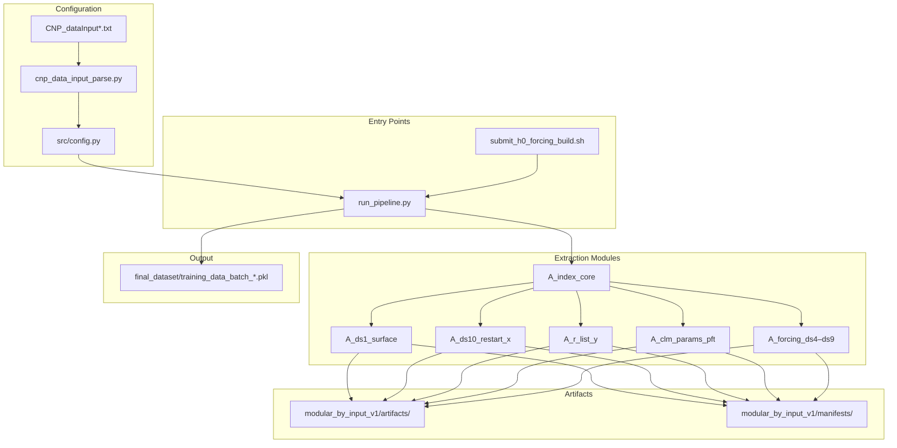
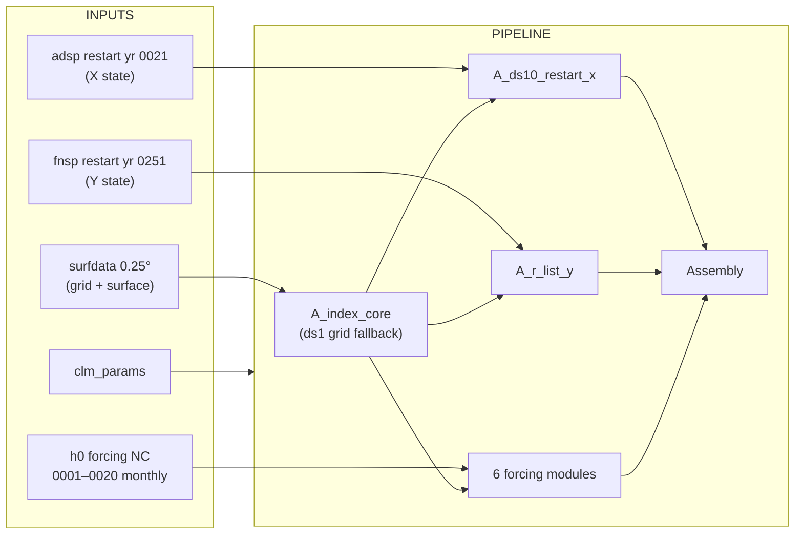
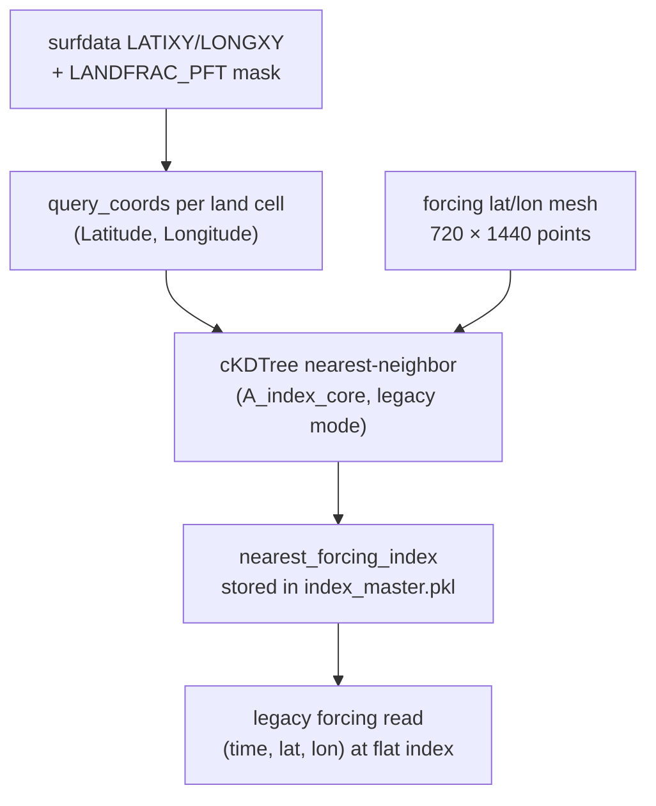
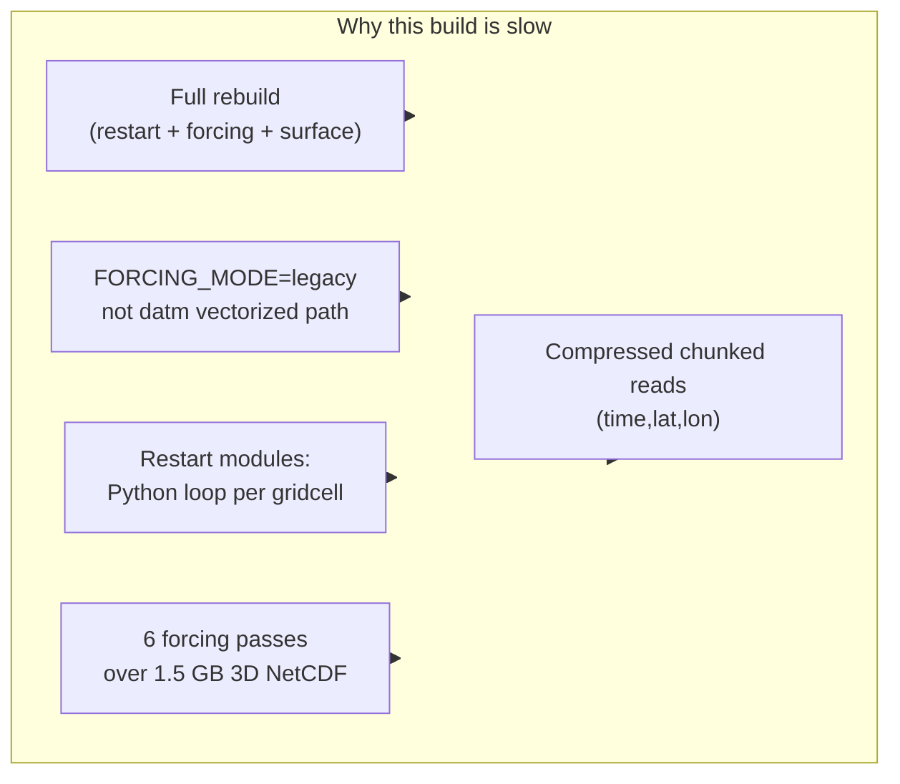

# LandSim_dataGEN Overview and h0-Forcing Notes

Date: 2026-06-11  
Worktree: `LandSim_dataGEN_h0_vectorized` (branch `h0-forcing-vectorized`)

This document summarizes the LandSim_dataGEN pipeline, the current h0-forcing build, and answers two practical questions about **spatial alignment** and **runtime performance**.

---

## 1. What LandSim_dataGEN Does

LandSim_dataGEN converts E3SM/ELM NetCDF inputs into batched AI training pickles:

- **Input:** surfdata, restart files, clm_params, atmospheric forcing
- **Output:** `final_dataset/training_data_batch_XX.pkl` (pandas DataFrames, ~1000 rows per batch)
- **Design:** modular artifacts per input source; rebuild only changed modules; assemble once

### High-level architecture



### Module map

| Module | Role | Primary input |
|--------|------|---------------|
| `A_index_core` | Select land cells; map to restart and forcing indices | ds1/ds2 grid, ds10, ds4 |
| `A_ds1_surface` | Static surface / soil / PFT fractions (X) | surfdata (ds1) |
| `A_ds2_history_x` | Scalar history features (X) | history grid (ds2); skipped if empty |
| `A_ds10_restart_x` | Initial restart state (X) | adsp restart (ds10) |
| `A_r_list_y` | Target restart state (Y) | fnsp restart (R_LIST) |
| `A_h0_list_y` | History-based Y targets | h0 monthly list; skipped if empty |
| `A_clm_params_pft` | Broadcast PFT parameters | clm_params |
| `A_forcing_ds4–ds9` | Monthly climate time series | forcing NetCDF |

Each module writes `artifacts/<module>/batch_XX.pkl` keyed by `__row_id`.

### Output layout

```
output_h0_forcing_0001_0020/
├── modular_by_input_v1/
│   ├── artifacts/
│   │   ├── A_index_core/          # index_master.pkl + batch_XX.pkl
│   │   ├── A_ds1_surface/
│   │   ├── A_ds10_restart_x/
│   │   ├── A_r_list_y/
│   │   ├── A_clm_params_pft/
│   │   └── A_forcing_ds{4-9}_*/
│   └── manifests/
├── final_dataset/
│   └── training_data_batch_XX.pkl
records/<RUN_ID>/run.log
logs/run.h0_forcing_build.<jobid>
```

---

## 2. h0-Forcing Variant (Current Run)



**Inputs for this run:**

| File | Purpose |
|------|---------|
| `surfdata_0.25x0.25_simyr1850_c240125_TOP.nc` | Grid + static surface |
| `20240214...adsp.elm.r.0021...nc` | Initial restart (X) |
| `20240223...fnsp.elm.r.0251...nc` | Target restart (Y) |
| `clm_params_c211124.nc` | PFT parameters |
| `forcing_TBOT_PBOT_QBOT_FLDS_FSDS_RAIN_SNOW_PRECmms_0001-0020.nc` | Monthly forcing |

**Variable aliases in `run_pipeline.py`:**

- `PBOT` → `PSRF`
- `PRECmms` → `PRECTmms`

**Config:** `config/CNP_dataInput_h0_forcing.txt`  
- `FORCING_MODE: legacy`  
- `DS2_PATH` and `H0_LIST_PATHS` empty → ds2/h0-list modules skipped  
- Global domain `LON1=-180, LON2=180` → 395,784 land cells, 396 batches

---

## 3. Question 1: Does the Monthly Forcing File Support Spatial Alignment?

### Short answer

**Yes.** The h0 forcing NetCDF carries explicit spatial coordinates (`lat`, `lon`) on a regular 0.25° grid. The pipeline uses those coordinates in `A_index_core` to assign each land cell a `nearest_forcing_index`. For this dataset, alignment is **exact** (0° offset).

### What is in the forcing file

From `forcing_TBOT_PBOT_QBOT_FLDS_FSDS_RAIN_SNOW_PRECmms_0001-0020.nc`:

| Item | Value |
|------|-------|
| Dimensions | `time=240`, `lat=720`, `lon=1440` |
| Coordinates | `lat`, `lon` (1D, degrees) |
| Variables | `(time, lat, lon)` e.g. `TBOT`, `FLDS`, `PBOT`, ... |
| Origin | Monthly ELM h0 files via `extract_forcing_variables.py` |

The extractor copies `lat`/`lon` directly from the first monthly h0 file, so the forcing grid is the **native h0/land model rectilinear grid**, not an unstructured tri-grid.

### How alignment works in the pipeline



**Step-by-step:**

1. **`A_index_core`** selects land cells from surfdata (`LATIXY`, `LONGXY`, `LANDFRAC_PFT` mask).
2. For each cell it stores `Latitude`, `Longitude`, `lat_idx`, `lon_idx`.
3. In **legacy mode**, it builds a KD-tree on the forcing `lat/lon` mesh and queries each land-cell coordinate.
4. The resulting `nearest_forcing_index` is a **flat index** into the `(lat, lon)` grid: `flat = lat_idx * n_lon + lon_idx`.
5. Forcing modules read time series using that flat index.

### Validation on the current build

Checked against `index_master.pkl` (395,784 rows):

| Check | Result |
|-------|--------|
| KD-tree mapping error (deg) | mean = 0.0, max = 0.0 |
| `lat_idx * 1440 + lon_idx == nearest_forcing_index` | 100% match |
| Sample surfdata vs mapped forcing coords | identical (e.g. 57.125°N, 116.125°W) |

**Interpretation:** the h0 forcing is already on the **same 0.25° rectilinear grid** as surfdata. The KD-tree step is correct but redundant here; a direct `(lat_idx, lon_idx)` lookup would give the same result.

### Comparison with the original vectorized / tri-grid workflow

| Aspect | Original vectorized (tri-grid → land) | Current h0-forcing |
|--------|---------------------------------------|---------------------|
| Forcing source | DATM / tri-grid inputs | Pre-interpolated h0 monthly fields |
| Grid relationship | Different meshes; KD-tree or DATM remap needed | Same rectilinear land grid |
| Alignment mechanism | KD-tree or DATM same-mesh / preprocess to `(time, gridcell)` | KD-tree on `lat/lon` (exact for this file) |
| Interpolation | Done during DATM preprocessing | Done upstream when h0 was written to `lat/lon` |

### Alignment with other datasets

| Dataset | Alignment method | Notes |
|---------|------------------|-------|
| **surfdata (ds1)** | Same `lat_idx/lon_idx` grid | Exact match to forcing |
| **restart (ds10)** | KD-tree: land coord → `grid1d_lat/lon` | Nearest ELM gridcell; stored as `nearest_restart_index` |
| **target restart (Y)** | Same grid maps as ds10 | Via `A_r_list_y` |
| **clm_params** | Broadcast to all rows | No spatial map |

**Takeaway:** forcing alignment is well supported and verified for this run. Restart alignment is separate (KD-tree to unstructured ELM gridcells) and is the same mechanism used in the original pipeline.

---

## 4. Question 2: Why Is Processing Slower Than the Original Vectorized Code?

### Short answer

The current h0 build is slow because it runs a **full modular rebuild** with the **`legacy` forcing path** and **non-vectorized restart extraction**. The original vectorized branch optimized **DATM forcing extraction** (`FORCING_MODE=datm`) with bulk array gathers; that fast path is **not used** in the h0 config.

### Observed timings (SLURM job 12080, `records/20260611T172112Z_h0_forcing_0001_0020/run.log`)

| Module | Elapsed | Notes |
|--------|---------|-------|
| `A_ds10_restart_x` | **43m 33s** | Per-gridcell Python loops |
| `A_r_list_y` | **1h 08m** | Same pattern on target restart |
| `A_clm_params_pft` | 3.5s | Broadcast only |
| `A_forcing_ds4_flds` | ~1h+ (in progress) | Legacy 3D NetCDF reads |

### Root causes



#### 4.1 Different code path: `legacy` vs `datm`

| | **DATM (vectorized)** | **Legacy (h0 current)** |
|---|----------------------|-------------------------|
| Forcing array shape | `(time, gridcell)` 2D | `(time, lat, lon)` 3D |
| Extraction | `arr[:, idx_arr]` bulk gather per batch | `_forcing_series_for_indices()` per batch |
| Index mapping | `_forcing_idx` column, one numpy slice | Partial row-wise reads into Python lists |
| Used by h0 config? | No | **Yes** (`FORCING_MODE: legacy`) |

The vectorization guide (`docs/vectorization_guide_only_20260322_en.md`) describes optimizations for `A_forcing_*` under the **DATM** branch. The h0 config does not enter that branch.

#### 4.2 Restart extraction dominates

`A_ds10_restart_x` and `A_r_list_y` iterate **every gridcell × every restart variable**, building nested Python lists and writing pickles. The 57 GB restart files amplify I/O cost. These modules were **not** the focus of the original forcing vectorization work and remain the largest bottleneck in a full rebuild.

#### 4.3 Six serial forcing passes

Each of the six forcing modules opens the same ~1.5 GB NetCDF and walks all 396 batches independently. Even with per-batch resume, this is ~6× I/O and CPU over the forcing file.

#### 4.4 NetCDF access pattern

The h0 forcing file uses zlib compression with small chunks `(1, 180, 360)` per time slice. Legacy per-cell reads from `(time, lat, lon)` trigger many small decompressions instead of one bulk slice per batch.

#### 4.5 Scope difference vs “original vectorized” workflow

The original vectorized branch often assumed:

- forcing already preprocessed to land gridcells, and/or
- only forcing modules rebuilt, with other artifacts reused.

The h0 worktree performs a **from-scratch modular build** (index, surface, restart, forcing, assembly), which necessarily includes the slow restart stages.

### What is *not* the problem

- **KD-tree alignment cost** — runs once in `A_index_core` (~14 s for 396k cells); negligible overall.
- **Wrong longitude filter** — fixed earlier (`LON1=-180`); index count is correct at 395,784.
- **Missing spatial metadata in forcing** — coordinates are present and alignment is exact.

---

## 5. Recommendations to Speed Up Future Runs

### Option A: Reuse existing artifacts (fastest for forcing-only changes)

If only forcing changed, rebuild forcing modules + assembly:

```bash
BUILD_MODE=resume bash scripts/run_h0_forcing_build.sh
```

with `BUILD_MODULES` limited to `A_forcing_ds4_flds ... A_forcing_ds9_tbot` (restart artifacts already done).

### Option B: Add a legacy vectorized forcing path

Preprocess h0 forcing once to `(time, gridcell)` using `nearest_forcing_index`, then use the same bulk gather as DATM mode. This avoids six passes over the 3D file.

### Option C: Switch h0 to DATM code path

Point `FORCING_MODE` to `datm` after a one-time conversion of the h0 NC to preprocessed 2D per-variable files on the land grid. The existing `build_forcing_module` DATM branch already vectorizes extraction.

### Option D: Use pickle recreation for forcing-only updates

Base `LandSim_dataGEN` provides `scripts/recreate_h0_forcing_pickles.py` to replace only the six forcing columns in existing final pickles — much faster when non-forcing data are unchanged.

---

## 6. Key Files

| File | Role |
|------|------|
| `config/CNP_dataInput_h0_forcing.txt` | Active h0 config |
| `scripts/run_pipeline.py` | Build + assemble engine |
| `scripts/run_h0_forcing_build.sh` | Local / nohup driver |
| `scripts/submit_h0_forcing_build.sh` | SLURM submit wrapper |
| `scripts/validate_final_dataset.py` | Post-build QA |
| `docs/pipeline_full_flow_with_index_focus_20260322_en.md` | Detailed pipeline design |
| `docs/vectorization_guide_only_20260322_en.md` | DATM forcing vectorization |

---

## 7. Summary

| Question | Answer |
|----------|--------|
| **1) Spatial info in forcing file?** | Yes — `lat`/`lon` on a 720×1440 grid. `A_index_core` maps land cells via KD-tree; for this h0 file alignment is exact (0° error). |
| **2) Why slower than vectorized?** | h0 run uses `legacy` 3D reads, full restart rebuild, and six forcing passes. Original vectorization optimized the DATM 2D bulk-gather path, which this config does not use. |
