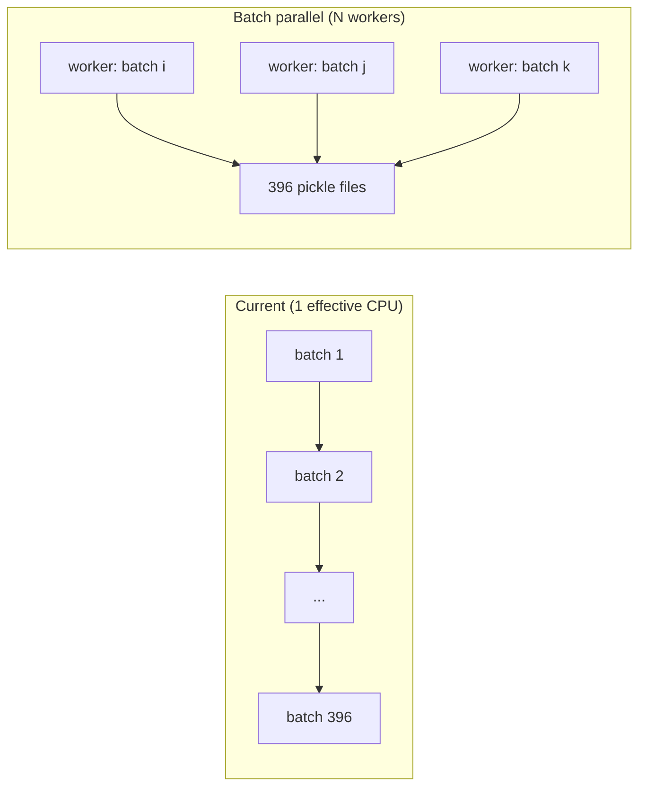

# Work Plan: Parallelization and Performance Improvements

**Status:** Draft — revisit when current h0-forcing build completes  
**Created:** 2026-06-11  
**Repo:** `LandSim_dataGEN_h0_vectorized`  
**Related docs:**
- `docs/landsim_datagen_overview_and_h0_forcing_notes.md`
- `docs/vectorization_guide_only_20260322_en.md`
- `docs/pipeline_full_flow_with_index_focus_20260322_en.md`

---

## 1. Background

The h0-forcing build (`config/CNP_dataInput_h0_forcing.txt`, `FORCING_MODE=legacy`) is significantly slower than the original vectorized branch. SLURM jobs currently request multiple CPUs (e.g. 16) but the pipeline runs **single-process, one batch at a time**.

### Observed timings (SLURM job 12080)

| Module | Elapsed | Notes |
|--------|---------|-------|
| `A_index_core` | ~14 s | Already fast |
| `A_ds1_surface` | ~23 min | Acceptable |
| `A_ds10_restart_x` | **~44 min** | Per-gridcell Python loops |
| `A_r_list_y` | **~68 min** | Same pattern on target restart |
| `A_clm_params_pft` | ~3.5 s | Broadcast only |
| `A_forcing_ds4–ds9` | **~1h+ each × 6** | Legacy 3D NetCDF reads |
| Assembly | TBD | 396 batch merges |

### Root causes (summary)

1. **Full modular rebuild** — restart + forcing + surface, not forcing-only.
2. **`FORCING_MODE=legacy`** — 3D `(time, lat, lon)` reads; DATM vectorized bulk-gather path unused.
3. **Restart modules** — Python loop per gridcell × many variables; not vectorized.
4. **Six serial forcing passes** — same ~1.5 GB NetCDF opened six times.
5. **Compressed chunked NetCDF** — small per-cell reads from `(time, lat, lon)`.

### Alignment (resolved — no action needed)

The h0 forcing file has `lat`/`lon` on a 720×1440 grid. `A_index_core` KD-tree mapping gives **exact** alignment (0° error) with surfdata. See overview doc §3.

---

## 2. Goal

Reduce end-to-end build time for future h0-forcing (and general LandSim) runs by combining:

1. **Algorithmic speedups** (vectorization)
2. **Batch-level parallelism** (multi-CPU on one node: up to 32–84 CPUs available)
3. **Operational shortcuts** (reuse artifacts, parallel modules)

**Target:** Cut full rebuild from ~6–8+ hours to **< 2 hours** on a single `parallel` node (estimate; validate after implementation).

---

## 3. Parallelism Analysis

### Why multi-CPU can work

The pipeline is **batch-parallel by design**:

- 396 independent batches per module (`batch_01.pkl` … `batch_396.pkl`)
- Each batch writes its own artifact file
- `module_batch_exists()` supports resume/skip



### Approach comparison

| ID | Approach | Effort | Speedup potential | Risk |
|----|----------|--------|-------------------|------|
| **A** | SLURM array (1 task = 1 batch) | Easy (~1–2 days) | High for restart/forcing | Many concurrent jobs on shared FS |
| **B** | `--workers N` in `run_pipeline.py` | Medium (~2–4 days) | High | Memory if too many workers on 57 GB restart |
| **C** | Vectorize legacy forcing (no extra CPUs) | Medium (~1–2 days) | **Very high for forcing** | Low; best ROI |
| **D** | Run 6 forcing modules in parallel | Easy (~0.5 day) | ~6× on forcing stage only | 6× NetCDF read load |
| **E** | 84–128 workers on current loops | Hard / low payoff | Poor | I/O saturation, memory |

### Per-module parallelization suitability

| Module | Parallelize batches? | Priority | Caveat |
|--------|-------------------|----------|--------|
| `A_index_core` | Low benefit | — | ~14 s total |
| `A_ds1_surface` | Yes | Low | One-time cost |
| `A_ds10_restart_x` | **Yes** | **P0** | Open restart per worker; cap workers |
| `A_r_list_y` | **Yes** | **P0** | Same as ds10 |
| `A_clm_params_pft` | No | — | Already ~3 s |
| `A_forcing_ds4–ds9` | **Yes** | **P0** | Also vectorize reads |
| Assembly | Yes | P1 | 396 independent merges |

### Implementation constraints

1. **NetCDF handles** — each worker opens its own `Dataset` (not thread-shared).
2. **57 GB restart file** — rely on OS page cache; recommend **16–32 workers** initially, not 84–128.
3. **Grid maps** (`pft_map`, `col_map`) — build once per worker via pool initializer; fork COW on Linux helps.
4. **Resume** — preserve `module_batch_exists()` skip logic in parallel workers.
5. **Logging** — coordinate progress output (per-worker log files or aggregated counter).

### CPU count guidance (hpcl-cli185 `parallel` partition)

| Workers | Expected use | Recommendation |
|---------|--------------|----------------|
| 16 | Safe starting point | Default for first implementation |
| 32 | Good balance I/O vs CPU | Recommended target |
| 84 | Node max (example E3SM jobs) | Unlikely linear speedup; test before relying |
| 128 | If available | Probably I/O-bound; diminishing returns |

---

## 4. Recommended Implementation Order

### Phase 0 — Complete current build (no code changes)

- [ ] Let SLURM job 12080 (or successor) finish forcing + assembly
- [ ] Run `validate_final_dataset.py`
- [ ] Record final timings in this doc (§7)

### Phase 1 — Legacy forcing vectorization (highest ROI, ~1–2 days)

**Objective:** Make h0 forcing use bulk numpy gather like DATM path, without switching to DATM preprocessing.

**Tasks:**

- [ ] In `build_forcing_module` legacy branch, replace per-cell `_forcing_series_for_indices` with batch-level slice:
  - For `(time, lat, lon)`: use `lat_idx = flat // n_lon`, `lon_idx = flat % n_lon`, gather by unique lat rows or full `arr[:, lat_idx, lon_idx]`
  - Prefer direct `lat_idx`/`lon_idx` from `index_master` (exact grid match verified)
- [ ] Add unit/smoke test on one batch (1000 cells, compare old vs new FLDS series)
- [ ] Optional: single preprocessing step → `(time, n_cells)` intermediate NC (one-time per forcing file)

**Files:** `scripts/run_pipeline.py` (`build_forcing_module`, `_forcing_series_for_indices`)

**Acceptance:** `A_forcing_ds4_flds` batch time drops by ≥10× on 1000-cell batch benchmark.

### Phase 2 — `--workers` batch parallelism (~2–4 days)

**Objective:** Parallelize batch loops within one SLURM job.

**Tasks:**

- [ ] Add CLI flag: `--workers N` (default 1) to `run_pipeline.py`
- [ ] Extract single-batch builders:
  - `_build_ds10_restart_x_batch(batch_id, ...)`
  - `_build_r_list_y_batch(batch_id, ...)`
  - `_build_forcing_module_batch(module_name, batch_id, ...)`
  - `_assemble_batch(batch_id)`
- [ ] Use `concurrent.futures.ProcessPoolExecutor` with `max_workers=N`
- [ ] Pool initializer: open ds10/ds_r/forcing once per worker, build maps once
- [ ] Keep `module_batch_exists` skip in each worker task
- [ ] Thread-safe progress logging (e.g. `multiprocessing.Value` counter)

**Files:** `scripts/run_pipeline.py`, `scripts/run_h0_forcing_build.sh`, `scripts/submit_h0_forcing_build.sh`

**Acceptance:** `A_ds10_restart_x` wall time at `--workers 16` ≤ 25% of single-worker time (ideal ~1/16; I/O may limit).

### Phase 3 — SLURM / driver updates (~0.5 day)

**Tasks:**

- [ ] Pass `--workers ${SLURM_CPUS}` from submit wrapper
- [ ] Default `SLURM_CPUS=32`, `OMP_NUM_THREADS=1` (avoid BLAS oversubscription inside workers)
- [ ] Document recommended `SLURM_MEM_PER_CPU` for 32 workers on 57 GB restart workload
- [ ] Optional: `BUILD_MODULES_PARALLEL=1` to run six forcing modules as six background processes (Phase 1/2 alternative)

**Files:** `scripts/submit_h0_forcing_build.slurm`, `scripts/submit_h0_forcing_build.sh`, `scripts/run_h0_forcing_build.sh`

### Phase 4 — SLURM array option (optional, ~1–2 days)

**Objective:** Alternative to in-process pool for largest modules.

**Tasks:**

- [ ] Add `scripts/submit_h0_forcing_array.slurm` with `#SBATCH --array=0-395`
- [ ] Thin driver: `build_single_batch.py --module A_ds10_restart_x --batch-id $SLURM_ARRAY_TASK_ID`
- [ ] Separate array jobs per module or parameterized module name

**When to use:** Full rebuild from scratch; in-process `--workers` insufficient due to memory.

### Phase 5 — Restart extraction vectorization (optional, larger effort)

**Objective:** Reduce cost of `A_ds10_restart_x` / `A_r_list_y` beyond batch parallelism.

**Tasks:**

- [ ] Profile per-variable extraction cost
- [ ] Batch-read restart arrays by `pft_idx`/`col_idx` groups instead of per-gridcell Python lists
- [ ] Consider xarray/dask for labeled indexing

**Effort:** ~1 week; lower priority if Phase 1+2 meet time target.

---

## 5. What NOT to do (yet)

- **Do not** expect 84–128 threads to speed up current Python `for gridcell_id` loops.
- **Do not** switch to `FORCING_MODE=datm` without a clear preprocessing plan for h0 NC.
- **Do not** remove KD-tree alignment (harmless for h0; needed for other grids).
- **Do not** parallelize across nodes unless shared filesystem contention is measured and acceptable.

---

## 6. Quick wins without code changes

For the **next** run after current build completes:

```bash
# Resume-only (skip finished artifacts)
BUILD_MODE=resume bash scripts/submit_h0_forcing_build.sh

# If only forcing changed in future, limit modules in run_h0_forcing_build.sh:
# A_forcing_ds4_flds ... A_forcing_ds9_tbot + assemble only
```

For **forcing-only updates** on existing final pickles (base repo path):

- `LandSim_dataGEN/scripts/recreate_h0_forcing_pickles.py` — patches six forcing columns only.

---

## 7. Benchmark log (fill in after runs)

| Run ID | Date | Workers | A_ds10 | A_r_list | Forcing (6×) | Assembly | Total | Notes |
|--------|------|---------|--------|----------|--------------|----------|-------|-------|
| 20260611T172112Z | 2026-06-11 | 16 (unused) | 43m33s | 1h08m | in progress | — | — | legacy, single-process |
| | | | | | | | | |
| | | | | | | | | |

---

## 8. Decision checklist (revisit before starting work)

- [ ] Current h0 final dataset validated and archived?
- [ ] Is next run a **full rebuild** or **forcing-only**?
- [ ] Target wall time acceptable with Phase 1 only (vectorize forcing)?
- [ ] Test node: `parallel` partition, 32 CPUs, 4gb/cpu — sufficient memory?
- [ ] Who owns regression test (one batch old vs new pickle diff)?

---

## 9. Fast solution for ds5–ds9 (implemented 2026-06-12)

### Problem

Tweaking `_forcing_series_for_indices()` alone does **not** help much (~2 min/batch).
The bottleneck is **repeated decompression** from the 1.5 GB `(time, lat, lon)` file,
done **six times** (once per variable), single-threaded.

### Recommended approach (implemented)

**Two-step fast path:**

1. **Preprocess once** → `(time, gridcell)` NetCDF per variable  
   `scripts/preprocess_h0_forcing_gridcell.py`  
   Streams lat rows (low memory), ~30–60 min for all 6 variables on compute node.

2. **Vectorized extraction** → bulk `arr[:, row_ids]` per batch  
   `run_pipeline.py` auto-detects `(time, gridcell)` and uses fast path.

**Driver for remaining modules:**

```bash
# After canceling slow job 12080 (optional: let ds5 finish first)
cd LandSim_dataGEN_h0_vectorized
bash scripts/run_h0_forcing_remaining_fast.sh
```

Or submit to SLURM with 32 CPUs (preprocess + build use 1 process but finish in <1h total).

**Files added:**

- `scripts/preprocess_h0_forcing_gridcell.py`
- `scripts/run_h0_forcing_remaining_fast.sh`
- `config/CNP_dataInput_h0_forcing_gridcell.txt`

**Expected time (after 2026-06-12 preprocess fix):** preprocess ~20–40 min + ds5–ds9 build ~10–30 min + assembly ~1–2 h  
(vs ~50+ h for remaining legacy path)

**Preprocess fix:** default `--mode memory` loads each `(time, lat, lon)` variable once (~1 GB),
gathers land cells with numpy indexing, and writes `(time, gridcell)` output. Avoids 720 slow
per-latitude reads from compressed source. Use `--overwrite` on rerun.

### Alternatives considered

| Option | Verdict |
|--------|---------|
| More vectorization on 3D file | Marginal (~5%); still ~13 h/var |
| `--workers 32` on current 3D reads | Helps but FS contention; still slow |
| Load full 3D array in RAM | ~1 GB/var, fast gather; needs compute node RAM |
| `recreate_h0_forcing_pickles.py` | Fast only if old final pickles exist (not here) |
| Run ds6–ds9 as parallel SLURM jobs | 4× files read from FS; still ~13 h each |

---

## 10. Summary

| Question | Answer |
|----------|--------|
| Is multi-CPU parallelism easy? | **Moderately easy** — batch artifacts are independent |
| Best first step? | **Phase 1:** vectorize legacy forcing reads |
| Best second step? | **Phase 2:** `--workers 16–32` on batch loops |
| Will 84–128 CPUs help linearly? | **Unlikely** — I/O and NetCDF decompression cap gains |
| Estimated implementation | **~3–5 days** for Phases 1–3; optional Phase 4–5 later |

---

*Update this document when implementation starts or when new timing data is available.*
